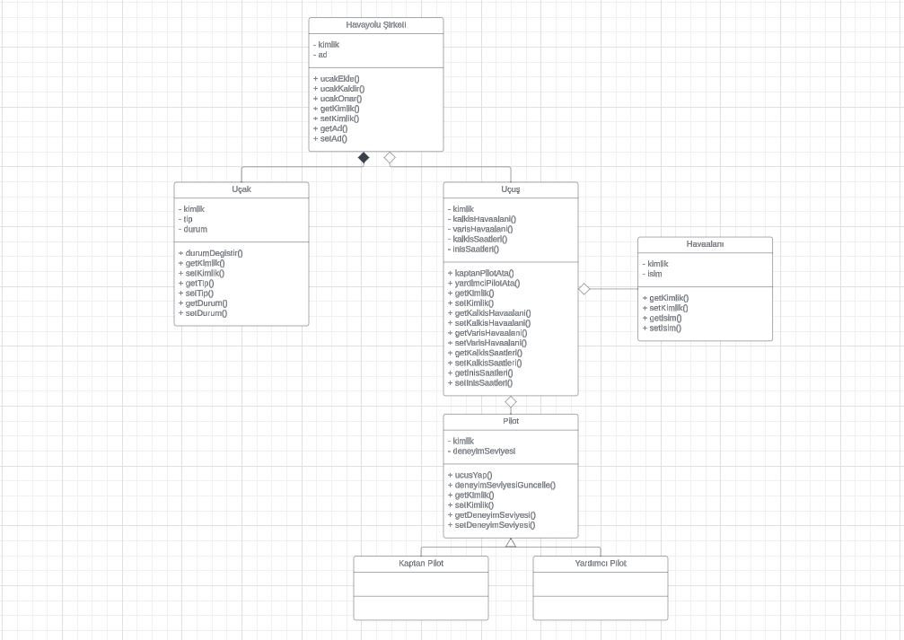

# Patika OOP (Object Oriented Programming) Dersi Uçuş Yönetim Sistemi UML Diyagram Projesi

Uçuş Yönetim Sistemi UML Diyagram Projesinin Linki

[Proje Diyagramına Git](https://lucid.app/lucidchart/b6026f32-4b34-43cf-ade1-7fffe3edca08/edit?viewport_loc=-1051%2C-136%2C3840%2C1776%2C0_0&invitationId=inv_a7cd236e-3304-483f-a9ce-4ac6629f98a2)

Proje Diyagramı Görselleri

